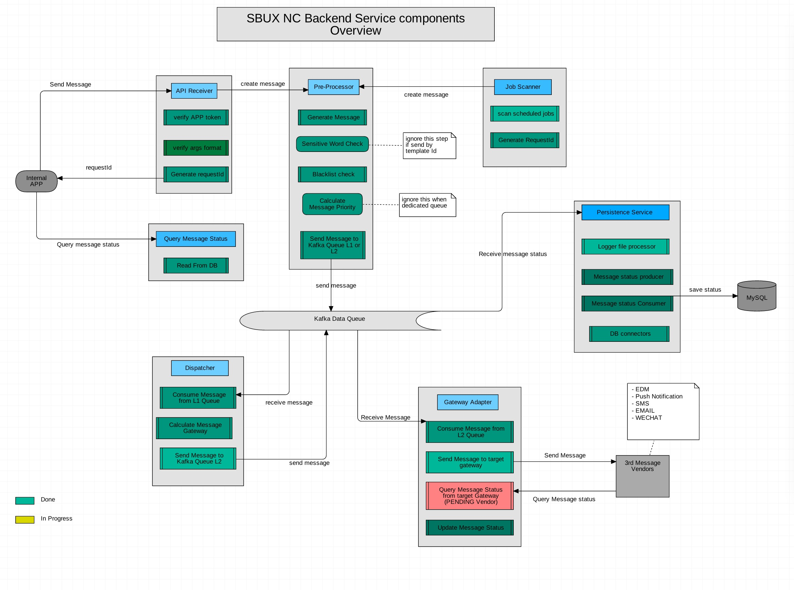

## API Standard documentation

## install gitbook and run book in your local
>
``` sudo  npm install -g gitbook-cli
create your SUMMARY.md file
run "gitbook init" to generate folder structures
```

or you can youse gitbook summary to maintain the book structure automatically.
```
sudo  npm install -g gitbook-summary
cd docs/
book sm  (this will generate the summary.md)
```

#### Release document
* ./gitbook.sh to dev  to  localtest http://127.0.0.1:4001
* ./gitbook.sh to pro  to  gitbooksofttek.sh
* Browser access http://127.0.0.1:PORT/
* sudo npm install gitbook-pdf -g convert to pdf
* gitbook pdf ./doc
* http://172.16.98.186:8080 (代理 需要刷新)
* http://172.16.98.186:4001 (gitbook)

##### how to use it
* 也可以用 gitbook-summary 生成目录 https://www.npmjs.com/package/gitbook-summary
* add  root catalog --- doc/SUMMARY.md
* add  second catalog eg : --- doc/apiCatalogue.md
* api doc eg :----doc/api/user/user.md

#### Tech share
* Flow controller （推荐)
   * https://github.com/bsspirit/async_demo
   * https://github.com/MedusaLeee/bluebird-demo





